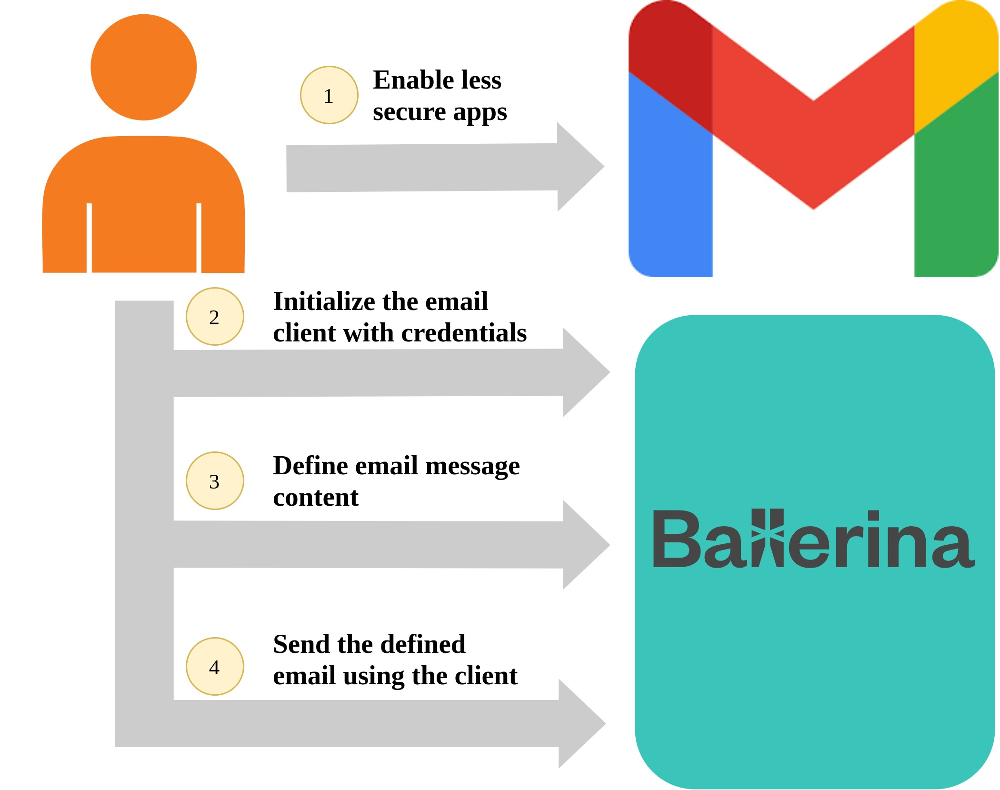

# SMTP Client for Gmail

## Overview

This guide explains how to securely send an email using the SMTP API of Gmail using Ballerina. 
The figure below illustrates a high-level design diagram of the complete use case.



The below are the detailed explanations of each of the steps.

### Step 1 - Enable Less Secure Apps in Gmail Account

By-default Gmail has a setting, which disables `Less Secure Apps` that prevents its SMTP API from being active. In order to send
emails using SMTP, that setting has to be enabled with [this link](https://myaccount.google.com/lesssecureapps).

### Step 2 - Initialize the Email Client with Credentials

In order to send an email, an SMTP Client has to be initialized with the Gmail server related connection details and user's
account credentials. By default, the Ballerina SMTP client is configured to run on port `465` with SSL, which is also used
in Gmail. As Gmail server certificates are signed by certificate authorities, there is no need to configure them in the
client.

```ballerina
    email:SmtpClient smtpClient = check new ("smtp.gmail.com", senderAddress, senderPassword);
```

### Step 3 - Define the Email Message Content

An `email:Message` record should be defined with the content to be sent along with the email. When the email is sent using
a Gmail server, the `'from` field can be excluded as it is the same as the username specified during the client initialization.

### Step 4 - Send the Defined Email Using the Client

Any number of different `email:Message` records can be used to send as emails sequentially using the initialized SMTP client.

## Testing

You can run the above code in your local environment. Navigate to the
[`examples/gmail-smtp-client/client`](./client) directory, and execute the command below.
```shell
$ bal run
```

The successful execution of the service should show the output below.
```shell
Compiling source
	smtp/gmail_sender:1.0.0

Running executable
```

Now, check the inbox of the email receiver. The sent email should be available after some time.
