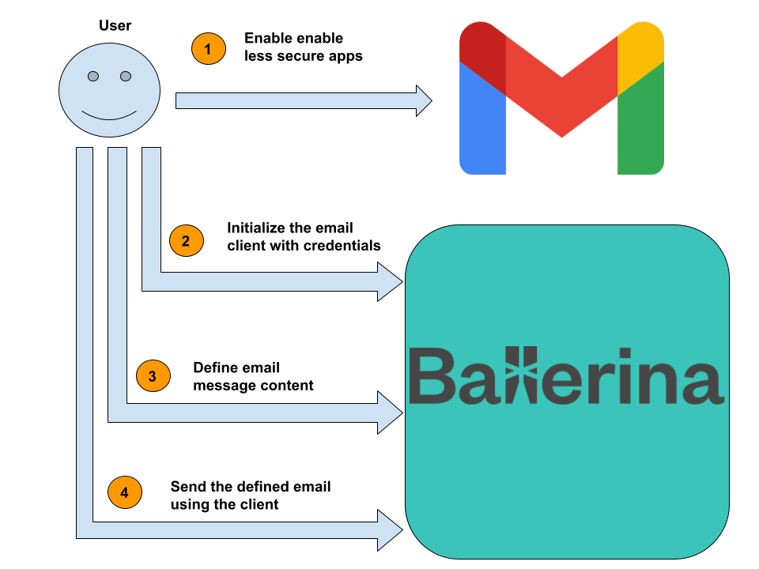

# SMTP Client for Gmail

## Overview

This guide explains how to securely send an email using the SMTP API of Gmail using Ballerina. 
The following figure illustrates a high level design diagram of the complete use case.



Following are the detailed explanations of each of the step.

### Step 1 - Enable Less Secure Apps in Gmail Account

By-default Gmail has a setting which disables `Less Secure Apps` which prevents its SMTP API active. In order to send
emails using SMTP that setting has to be enabled with [this link](https://myaccount.google.com/lesssecureapps).

### Step 2 - Initialize the Email Client with Credentials

In order to send an email, SMTP Client has to be initialized with Gmail server related connection details and user's
account credentials. By-default, Ballerina SMTP client is configured to run on port `465` with SSL which is also used
in Gmail. As Gmail server certificates are signed by certificate authorities there is no need to configure them in the
client.

```ballerina
    email:SmtpClient smtpClient = check new ("smtp.gmail.com", senderAddress, senderPassword);
```

### Step 3 - Define the Email Message Content

`email:Message` record should be defined with the content to be sent along with the email. When the email is sent using
a Gmail server, `'from` field can be excluded as it is same as the username specified during the client initialization.

### Step 4 - Send the defined Email using the Client

Any number of different `email:Message` records can be used to send as emails using the initialized SMTP client,
sequentially.

## Testing

We can run the above developed code, in our local environment. Navigate to
[`examples/gmail-smtp-client/client`](./client) directory and execute the following command.
```shell
$ bal run
```

The successful execution of the service should show us the following output.
```shell
Compiling source
	smtp/gmail_sender:1.0.0

Running executable
```

Now, check the inbox of the email receiver. Sent email should be available after some time.
